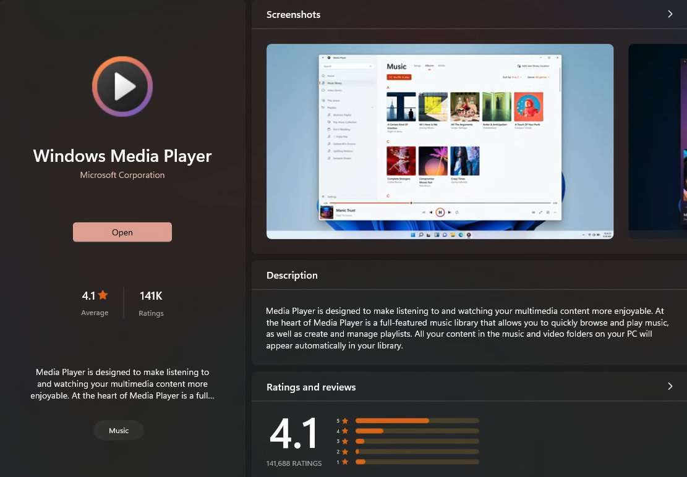

# Window Open Video Freeze WebUI

### Video Of Bug
   

### How to reproduce
1. `npm install`
2. `npm run dev`
3. Install Windows Media Player from the Windows App Store. 
    
4. Set Window's Media player as default .mp4 player
5. Click Open Video. I have provided one in one `/src/assets/pikmin.mp4` this is a pikmin 4 video.
6. Video opens with no error
7. Interact with the Tauri window and notice it is not responding
